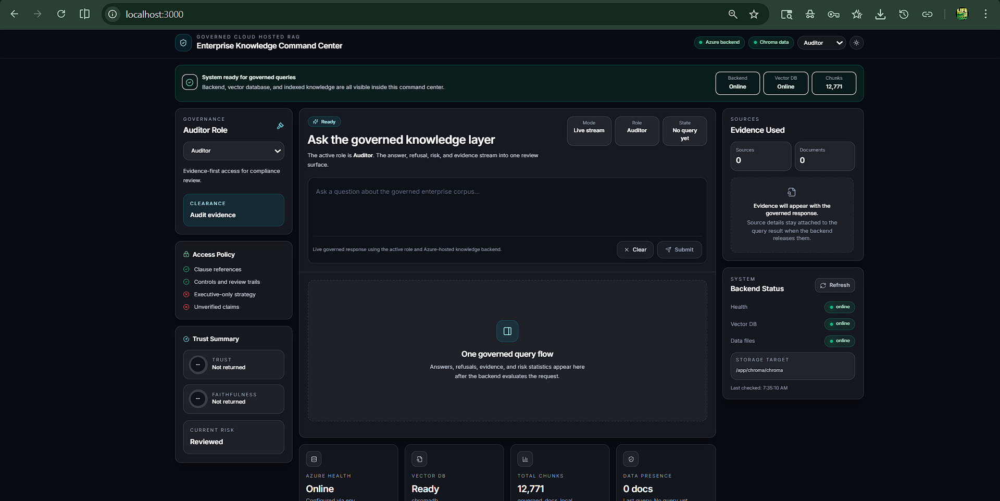

# Governed RAG System for Enterprise Knowledge

---

# System Demo



---

A cloud-hosted Retrieval-Augmented Generation (RAG) platform that enforces **role-based access control, trust scoring, and evidence-backed responses** for enterprise-grade knowledge systems.

---

# Why This Exists

Traditional AI systems:

* hallucinate ❌
* leak sensitive info ❌
* lack accountability ❌

This system solves that by introducing a **governed knowledge layer** where:

* Access is controlled by **user roles**
* Every answer is backed by **retrieved evidence**
* Low-confidence outputs are **blocked or refused**
* Responses are evaluated for **faithfulness + trust**

---

# Architecture

```text
User (Next.js UI)
        ↓
Next.js API Routes (/api/query)
        ↓
Azure Hosted FastAPI Backend
        ↓
RAG Pipeline
  ├── Embeddings (OpenAI / Anthropic)
  ├── ChromaDB (Vector Store)
  ├── Retrieval Layer
  ├── Decision Gate (RBAC + Trust)
  └── Response Generator
```

---

# Governance Model

| Role      | Access Behavior                    |
| --------- | ---------------------------------- |
| Public    | Highly restricted, mostly refusals |
| Auditor   | Evidence-focused access            |
| Manager   | Partial operational insights       |
| Executive | Full strategic access              |

---

# Key Capabilities

* Role-Based Access Control (RBAC)
* Trust & Faithfulness Scoring
* Evidence-backed responses (with metadata)
* Refusal system for unsafe queries
* Azure-hosted backend (production-ready)
* NDA corpus ingestion (~12K chunks)
* Interactive command-center UI

---

# Live Backend

```
https://rag-api.proudpebble-8567eb99.eastus.azurecontainerapps.io
```

Frontend routes proxy requests through `/api/query` using:

```
BACKEND_API_BASE_URL
```

---

# Tech Stack

* **Frontend:** Next.js, Tailwind CSS
* **Backend:** FastAPI
* **Cloud:** Azure Container Apps
* **Vector DB:** ChromaDB
* **LLMs:** OpenAI / Anthropic

---

# Local Setup

```powershell
py -3.11 -m venv .venv
.venv\Scripts\Activate.ps1
py -3.11 -m pip install -r requirements.txt
npm install
Copy-Item .env.template .env
```

# Environment Variables

```env
OPENAI_API_KEY=
ANTHROPIC_API_KEY=
BACKEND_API_BASE_URL=https://rag-api.proudpebble-8567eb99.eastus.azurecontainerapps.io
```

---

# Run

Frontend (recommended):

```powershell
npm run dev:ui
```

Backend (optional local run):

```powershell
npm run dev:api
```

---

# NDA Corpus Ingestion

```powershell
py -3.11 main.py ingest --profile nda --replace-existing --source-dir "<your-nda-folder>"
```

# Pipeline Features

* Cleans headers/footers automatically
* Clause-aware chunking
* Metadata tagging:

  * document_type
  * clause_type
  * page_number
  * sensitivity_level
* Logs ingestion batches + failures

---

## Query Behavior

The `/query` endpoint enforces governance:

* Refuses when evidence is weak
* Returns trust score
* Returns faithfulness score
* Provides traceable sources

---

# Deployment

```powershell
.\deploy.ps1
```

* FastAPI → Azure Container Apps
* Next.js → Azure Container Apps
* ChromaDB → Azure File Share (`/mnt/chroma`)

---

# What Makes This Different

This is **not just a chatbot**.

It is a **governed AI system** that introduces:

* Decision-layer validation
* Evidence-first reasoning
* Enterprise-safe AI interaction

---

# Author

**Samikshit Sharma**
Cloud Engineering • AI Systems • Distributed Architectures

---

# Future Enhancements

* Multi-tenant RBAC
* Audit dashboards
* CI/CD pipeline
* Model fine-tuning for domain accuracy
